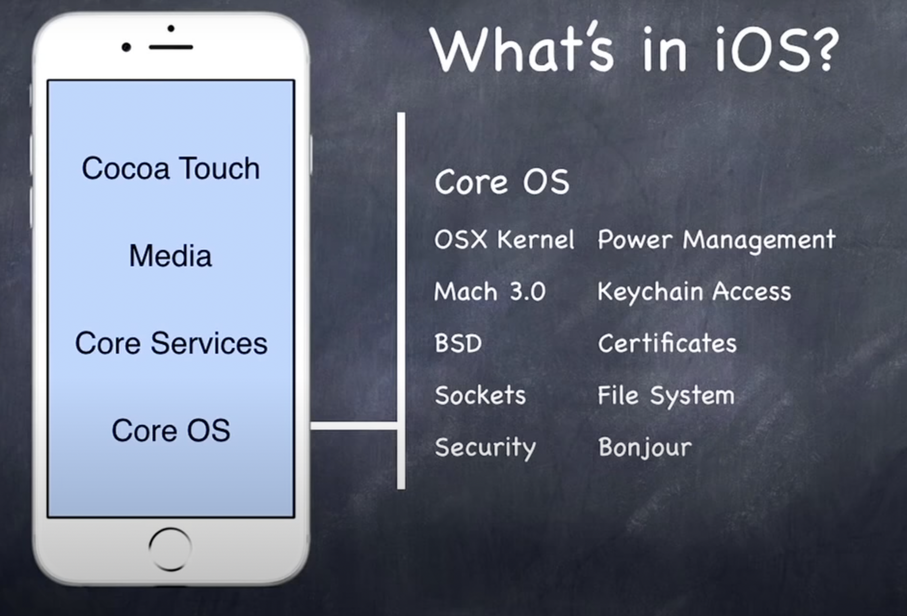

# stanford_uikit

*   인프런 강의를 정리하기 위한 레포지터리입니다.
*   [출처](https://www.inflearn.com/course/stanford-ios-%ED%95%9C%EA%B8%80%EC%9E%90%EB%A7%89-%EA%B0%95%EC%9D%98/dashboard)

## 개요

*   iOS는 동작하는데 대표적으로 4개의 계층으로 구성되어 있음
*   iOS는 UNIX 기반으로 동작이 됨 